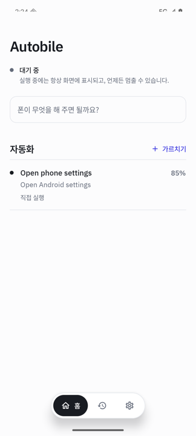
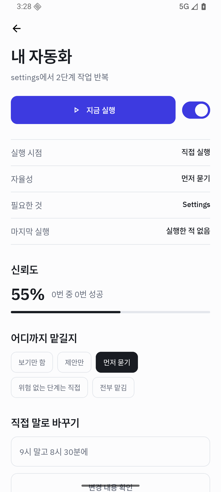
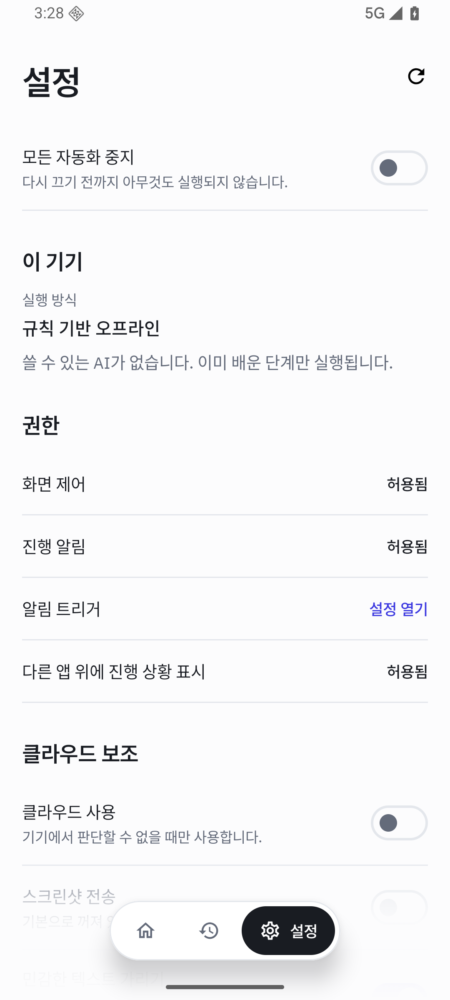

# Autobile

[English](README.md) · **한국어**

Autobile은 안드로이드 폰에서 하는 반복 작업을 한 번 지켜본 뒤, 대신 실행해 주는 앱입니다.
정해진 시각에, 특정 알림이 왔을 때, 또는 원할 때 다시 실행합니다.

매크로 녹화기가 아닙니다. 녹화기는 고정된 좌표를 다시 누르기 때문에 앱이 버튼을 옮기는
순간 망가집니다. Autobile은 각 항목이 **무엇을 뜻했는지**를 기록합니다 — "일별 매출 메뉴",
"어제", "보내기 버튼" — 그래서 화면이 바뀌어도 다시 찾아냅니다.

<p align="center">
  
  
  
</p>

## 이런 걸 맡길 수 있습니다

매일 똑같이 반복하는 일들입니다.

- **일일 보고.** 업무 앱을 열어 전날 수치를 확인하고, 평일 오전 9시에 채팅 채널에 올리기
- **도착 알림 처리.** 배송 완료 알림이 오면 택배 앱을 열어 상태를 확인하고 기록해 두기
- **파일 정리.** 채팅으로 받은 문서를 열어 알맞은 폴더에 저장하고 읽음 처리하기
- **매번 같은 방식으로 하는 번거로운 일.** 메뉴 세 단계 아래에 있는 다섯 번의 탭

한 번만 가르치면 됩니다. 이후에는 알아서 실행하고, 무엇을 했는지 보여 줍니다.

## 시작하기

### 1. 설치

[최신 릴리스](https://github.com/autobile/autobile/releases/latest)에서 `autobile-0.1.6.apk`를
내려받아 설치하세요. Google Play에는 없습니다 — [배포](#배포) 항목을 참고하세요.

Android 11 이상이 필요합니다.

### 2. 화면 제어 권한 주기

처음 실행하면 앱이 안내합니다. 안드로이드의 **접근성 권한**이 필요합니다. 화면에 무엇이
있는지 읽고 대신 눌러 주는 데 쓰입니다.

큰 권한이고, 앱도 그렇게 설명합니다. 이 권한이 없으면 아무것도 할 수 없고, 있으면 여러분이
여는 모든 화면을 볼 수 있습니다.

설정 과정에서 알림 표시 권한도 함께 요청합니다. 허용하시길 권합니다. 자동화는 다른 앱을 여는
방식으로 동작하므로, 알림이 지금 무엇이 실행 중인지 보여 주고 멈출 수단이 되며, 끝난 뒤
Autobile로 돌아오는 길이 됩니다. 나머지 두 권한은 정말 선택입니다. 알림 *접근*은 알림
트리거를, 다른 앱 위에 표시는 조작 중인 앱 위에 진행 상황을 그려 줍니다.

### 3. 한 번 실행되는 걸 보기

설정 과정에 안전한 첫 자동화가 들어 있습니다. 폰 설정을 연 뒤 설정 앱이 실제로 떴는지
확인합니다. 직접 뭔가를 가르치기 전에, 에이전트가 폰을 다루는 모습을 먼저 보시라고 넣었습니다.

### 4. 직접 가르치기

**가르치기**를 누르고 이름을 정한 뒤 기록을 시작합니다. 그다음:

1. Autobile을 벗어나 평소 쓰는 앱으로 이동
2. 작업을 평소처럼 한 번 수행
3. 알림을 눌러 돌아와 **마치고 이해시키기**

그러면 Autobile이 무엇을 하려던 것인지 말해 줍니다.

> 이렇게 이해했습니다
> **전날 순매출을 확인해서 #daily-sales에 올리기**

여기서 꼼꼼히 읽어 보세요. 잘못 이해한 것을 잡아내기에 가장 싼 시점이고, 일주일 뒤에
발견하는 것보다 훨씬 낫습니다. 틀렸다면 직접 말로 고치면 됩니다 — "총매출 말고 순매출을
보내는 거야" — 그러면 문구만이 아니라 단계 자체가 다시 작성됩니다.

### 5. 언제 실행할지 정하기

자동화 화면에서 정할 수 있습니다.

- **실행 시점** — 직접 실행, 매일 정해진 시각, 또는 알림이 왔을 때
- **어디까지 맡길지** — 보기만 함부터 전부 맡김까지

메시지를 보내거나, 돈을 쓰거나, 무언가를 삭제하는 동작은 어디까지 맡겼든 먼저 물어봅니다.
그 자동화를 명시적으로 신뢰하기 전까지는 그렇습니다.

## AI는 어떻게 쓰이나요

Autobile은 답할 수 있는 가장 값싼 방법부터 시도하고, 필요할 때만 위로 올라갑니다.

| | 하는 일 | 필요한 것 |
|---|---|---|
| **1. 규칙** | 가르칠 때 기록해 둔 id나 문구로 항목을 찾음 | 없음 |
| **2. 기기 내 AI** | 앱이 바뀌었을 때 같은 의미의 항목이 무엇인지 판단 | 기기 내 AI를 지원하는 폰 |
| **3. 로컬 모델** | 같은 일을, 내려받은 모델로 | 선택, 기본 꺼짐 |
| **4. 클라우드** | 더 어려운 문제: 화면이 재설계됐거나 경로가 달라졌을 때 | 본인의 API 키 |

**대부분의 실행은 1단계에서 끝납니다.** 익숙한 작업을 하는 안정된 자동화는 추론도 네트워크도
없이 완료됩니다. 2~4단계는 앱이 업데이트되는 날을 위한 것입니다.

**설정 → 이 기기**에서 내 폰이 어디까지 할 수 있는지 확인할 수 있습니다. 시작할 때 감지해서
그대로 알려 줍니다. 되는 척하지 않습니다.

### AI 없이 쓰기

됩니다. 이미 가르친 자동화는 규칙만으로 계속 실행됩니다. 다만 앱이 화면 구성을 바꿨을 때
적응하지 못합니다. 찾을 수 없게 된 단계는 조용히 망가지는 대신, 멈추고 그 사실을 알려 줍니다.

### 클라우드 연결하기

선택 사항이고 기본으로 꺼져 있으며, 켜기 전에는 아무것도 폰을 떠나지 않습니다.

1. [Google AI Studio](https://aistudio.google.com/apikey)에서 API 키 발급
   (무료 한도가 제공됩니다)
2. **설정 → 클라우드 보조 → 클라우드 사용**
3. 키 붙여넣기

엔드포인트는 기본적으로 Google Gemini API를 쓰지만 수정할 수 있으므로, 직접 운영하는 호환
서버를 지정해도 됩니다.

스위치를 둘로 나눈 데는 이유가 있습니다.

- **클라우드 사용**은 화면을 짧은 텍스트로 설명해 보냅니다. 픽셀이 아니라 항목 이름입니다.
  폰에서 판단할 수 없을 때만 보냅니다.
- **스크린샷 전송**은 별개의 선택입니다. 화면의 글자 몇 줄은 괜찮지만 화면 사진은 안 된다는
  분이 많습니다.

무엇을 보내든 그 전에 Autobile은 화면을 꼭 필요한 항목 몇 개로 줄이고, 인증번호·카드번호·
주소처럼 보이는 것은 가립니다.

## 하지 않는 일

빠진 기능이 아니라 의도한 제한입니다.

- **비밀번호 관리자와 인증 앱은 차단**되며, 자동화가 이를 풀 수 없습니다
- **금융·건강 앱은 먼저 물어봅니다.** 분류되지 않은 앱도 마찬가지입니다
- **보호된 화면에서는 멈춥니다.** 민감한 내용이 있어 안드로이드가 화면 캡처를 거부하면,
  우회하지 않고 그 사실을 알리고 중단합니다
- **일부만 된 실행은 일부만 됐다고 말합니다.** 몇 단계는 됐지만 목표에 도달하지 못했다면
  그대로 표시합니다. 끝나지 않은 일을 끝났다고 말하는 것이 이 앱이 할 수 있는 최악의 일입니다
- **의미가 바뀌는 수리는 사용자를 기다립니다.** 옮겨진 버튼을 다시 찾는 것은 스스로 하지만,
  "이 숫자를 읽기"를 "이 숫자를 보내기"로 바꾸는 일은 묻지 않고 하지 않습니다

설정 맨 위에 **모든 자동화 중지** 스위치가 있습니다. 켜 두면 아무것도 실행되지 않습니다.

## 언어

영어와 한국어를 지원하며, 안드로이드 설정에서 고른 앱별 언어를 따릅니다.

언어 추가는 파일 하나면 됩니다.

1. `app/src/main/res/values/strings.xml`을 `app/src/main/res/values-<코드>/strings.xml`로 복사
2. `name` 속성은 그대로 두고 값만 번역
3. 빌드

그 외에 고칠 곳은 없습니다. 안드로이드가 제공하는 언어 목록은 존재하는 `values-<코드>`
폴더에서 생성되므로 번역과 어긋날 일이 없습니다.

저장된 실행 기록은 의도적으로 실행 당시의 문구를 유지합니다. 나중에 언어가 바뀌는 기록은
더 이상 무슨 일이 있었는지에 대한 기록이 아니기 때문입니다.

## 프로젝트 상태

초기 단계입니다. 핵심 루프(시연 → 확인 → 컴파일 → 재실행 → 검증 → 복구)는 동작하며,
182개의 단위 테스트와 실기기에서 축소된 릴리스 빌드로 실행되는 계측 테스트가 이를 검증합니다.
아직 측정되지 않은 것은, 서드파티 앱 전반에서 학습된 자동화가 얼마나 안정적으로 유지되는지입니다.

한번 써 보시고 무엇이 깨지는지 알려 주세요. 중요한 일을 무인으로 맡기기에는 아직 이릅니다.

## 배포

Google Play에는 등록하지 않았습니다. 안드로이드 접근성 정책은 해당 권한으로 할 수 있는 일을
제한하고, 스토어 규정도 시간이 지나며 바뀝니다. 전체 런타임을 담은 빌드라면 직접 배포가
적절한 방식입니다. 위 APK는 고정된 키로 서명되어 있어, 이 프로젝트에서 나오지 않은
업데이트는 안드로이드가 거부합니다.

---

## 개발자용

### 빌드

Android SDK 36과 **JDK 21**이 필요합니다. Robolectric의 Android 36 샌드박스가 17에서는
동작하지 않습니다. `local.properties`에 `sdk.dir`을 지정하거나 `ANDROID_HOME`을 설정한 뒤:

```bash
./gradlew assembleDebug
```

### 테스트

```bash
./gradlew lintDebug test assembleDebug
```

CI가 모든 풀 리퀘스트에서 같은 명령을 실행합니다.

계측 테스트는 연결된 기기나 에뮬레이터가 필요합니다.

```bash
./gradlew connectedAndroidTest
```

직렬화되거나 리플렉션으로 참조되는 부분을 바꾼다면, 실제 릴리스 축소 규칙이 적용된 빌드로도
실행하세요.

```bash
./gradlew connectedAndroidTest -PautobileTestBuildType=releaseTest
```

저장된 자동화는 생성된 직렬화기를 통해 복원되는데, R8이 이를 제거해도 빌드는 성공하고 단위
테스트도 전부 통과합니다. 이 실패는 업데이트 이후 사용자 기기에서 처음 드러나며, 가르쳐 둔
자동화가 전부 사라지는 형태로 나타납니다.

### 모듈 구조

```text
app/       Compose UI, 온보딩, 의존성 구성, 사용자 설정
core/      도메인 모델, 프라이버시를 고려한 저장소, 정책, 이력, 지표
ai/        공급자 중립 추론 인터페이스, 런타임 라우터, 범위가 한정된 작업
runtime/   접근성, 인식, 실행, 검증, 복구, 트리거
```

의존성은 안쪽을 향합니다. `app`이 프로세스를 조립하고, `runtime`이 에이전트 루프를 소유하며,
`ai`가 추론 경계를 담당하고, `core`는 어느 쪽에도 의존하지 않습니다.

### 기여

[CONTRIBUTING.md](CONTRIBUTING.md)를 참고하세요. 버그 제보와 제안은
[이슈](https://github.com/autobile/autobile/issues)로 환영합니다. 실행 중인 설치본을 공격하는 데
쓰일 수 있는 내용은
[비공개 보안 신고](https://github.com/autobile/autobile/security/advisories/new)로 보내 주세요 —
[SECURITY.md](SECURITY.md)에 절차가 있습니다.

### 라이선스

[MIT](LICENSE).
