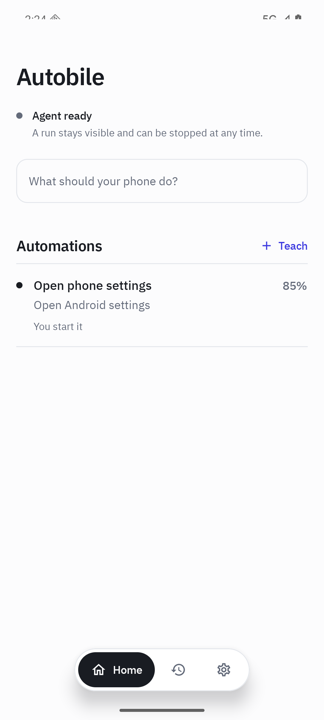
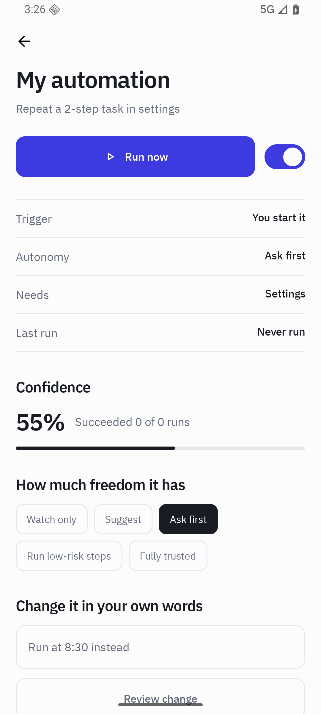
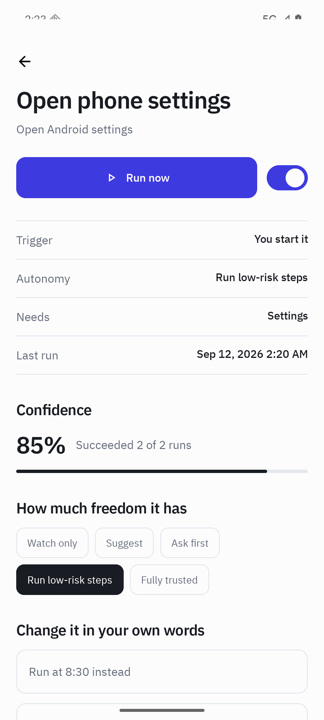

# Autobile

**English** · [한국어](README.ko.md)

Autobile learns a routine on your Android phone by watching you do it once, then repeats
it for you — on a schedule, when a notification arrives, or whenever you ask.

It is not a macro recorder. A recorder replays taps at fixed coordinates and breaks the
moment an app moves a button. Autobile records what each control *meant* — "the daily
sales menu", "yesterday", "the send button" — and finds those things again on a screen
that has changed.

<p align="center">
  
  
  
</p>

## What you can do with it

A few things people actually repeat every day:

- **A daily report.** Open your work app, read yesterday's figure, post it to a chat
  channel at 9:00 every weekday.
- **Arrival routine.** When a delivery notification arrives, open the courier app, check
  the status and save it somewhere.
- **Filing.** Open a document that arrived in a chat, save it to the right folder, mark
  the message read.
- **Anything fiddly you do the same way every time.** Five taps buried three menus deep,
  done for you.

You teach it once. After that it runs without you, and shows you what it did.

## Getting started

### 1. Install

Download `autobile-0.1.2.apk` from the
[latest release](https://github.com/autobile/autobile/releases/latest) and install it.
Autobile is not on Google Play — see [Distribution](#distribution).

You will need Android 11 or newer.

### 2. Grant screen control

Autobile walks you through this on first launch. It needs Android's **accessibility
access**, which is what lets it read what is on screen and tap for you.

This is a large permission and the app says so plainly. Without it Autobile cannot do
anything at all; with it, it can see any screen you open.

Setup also asks to post notifications. Worth allowing: an automation works by opening
someone else's app, and the notification is how you see what is running, stop it, and get
back to Autobile afterwards. Two further permissions are genuinely optional —
notification *access* enables notification triggers, and display-over-apps draws progress
on top of the app being operated.

### 3. Watch one run

Setup includes a safe first automation that opens your phone's settings and then checks
that the settings app actually appeared. It exists so you can see the agent operate the
phone before you teach it anything of your own.

### 4. Teach your own

Tap **Teach**, give it a name, and start recording. Then:

1. Leave Autobile and go to the app you actually use
2. Do the task once, normally
3. Come back through the notification and tap **Finish and understand**

Autobile then tells you what it thinks you were doing:

> This is what I understood
> **Check yesterday's net sales and post it to #daily-sales**

Read it carefully. This is the moment to catch a misunderstanding, and it is much cheaper
than catching it a week later. If something is wrong, type the correction in your own
words — "send net sales, not gross" — and the steps get rewritten, not just the label.

### 5. Decide when it runs

On the automation's page you set:

- **Trigger** — you start it, a time each day, or a notification arrives
- **How much freedom it has** — from watch-only to fully trusted

Anything that sends a message, spends money or deletes something asks you first, whatever
freedom you granted, until you explicitly trust that automation.

## How the AI part works

Autobile tries the cheapest thing that can answer, and only escalates when it has to:

| | What it does | Needs |
|---|---|---|
| **1. Rules** | Finds the control by the id or label recorded when you taught it | Nothing |
| **2. On-device AI** | Works out which control means the same thing when the app changed | A phone with on-device AI |
| **3. Local model** | Same job, using a model you downloaded | Optional, off by default |
| **4. Cloud** | Harder problems: a redesigned screen, a new path to the same goal | Your own API key |

**Most runs never get past step 1.** A stable automation doing a familiar task completes
with no inference and no network at all. Steps 2 to 4 exist for the day the app updates.

Open **Settings → This device** to see which of these your phone can actually do. Autobile
detects it at startup and tells you, rather than pretending.

### Using it without any AI

It works. Automations you have already taught keep running on rules alone. What you lose
is the ability to adapt when an app changes its layout — a step that can no longer be
found pauses and says so, instead of the automation quietly breaking.

### Connecting a cloud provider

Optional, off by default, and nothing leaves your phone until you turn it on.

1. Get an API key from [Google AI Studio](https://aistudio.google.com/apikey), which has
   a free tier
2. **Settings → Cloud assistance → Use the cloud**
3. Paste the key

The endpoint defaults to Google's Gemini API and is editable, so you can point it at a
compatible deployment you control instead.

Two separate switches, on purpose:

- **Use the cloud** sends a short text description of the screen — element labels, not
  pixels — when nothing on the phone can answer
- **Send screenshots** is a second, independent choice. Many people are fine sending a few
  lines of interface text and not fine sending a picture of their screen.

Before anything is sent, Autobile cuts the screen down to the handful of elements that
matter and masks anything that looks like a code, card number or address.

## What it will not do

Deliberate limits, not missing features:

- **Password managers and authenticators are blocked**, and cannot be unblocked by an
  automation
- **Financial and health apps ask first**, as does any app Autobile does not recognise
- **A protected screen stops the run.** If Android refuses a screenshot because the window
  holds sensitive content, Autobile reports that and stops rather than working around it
- **A partial run is reported as partial.** If some steps worked and the goal was not
  reached, it says so. Telling you an automation finished when it did not is the worst
  thing this app could do
- **A repair that changes meaning waits for you.** Autobile will re-point a step at a
  moved button on its own; it will not turn "read this number" into "send this number"
  without asking

There is a **Stop all automation** switch at the top of settings. Nothing runs while it
is on.

## Languages

English and Korean, following the per-app language you pick in Android settings.

Adding a language is one file:

1. Copy `app/src/main/res/values/strings.xml` to `app/src/main/res/values-<code>/strings.xml`
2. Translate the values, leaving the `name` attributes alone
3. Build

Nothing else needs editing. The list Android offers is generated from whichever
`values-<code>` folders exist, so it cannot drift out of step with the translations.

Stored execution history deliberately keeps the wording it had when the run happened,
because a record that changes language later is no longer a record of what happened.

## Project status

Early. The core loop — teach, confirm, compile, replay, validate, repair — works and is
covered by 182 unit tests plus instrumentation tests that run on a device against the
shrunk release build. What has not been measured at scale is how reliably learned
automations hold up across the long tail of third-party apps.

Try it and report what breaks. Do not rely on it unattended for anything that matters yet.

## Distribution

Autobile is not on Google Play. Android's accessibility policy restricts what an app may
do with that permission, and store rules change over time. Direct release is the
appropriate channel for the full runtime; the APK above is signed with a stable key, so
Android will refuse an update that did not come from this project.

---

## For developers

### Build

Android SDK 36 and **JDK 21** — Robolectric's Android 36 sandbox does not run on 17. Set
`sdk.dir` in `local.properties` or export `ANDROID_HOME`, then:

```bash
./gradlew assembleDebug
```

### Test

```bash
./gradlew lintDebug test assembleDebug
```

CI runs the same command on every pull request.

Instrumentation tests need a connected device or emulator:

```bash
./gradlew connectedAndroidTest
```

Before changing anything serialised or reached reflectively, run them against a build
carrying the real release shrinking rules:

```bash
./gradlew connectedAndroidTest -PautobileTestBuildType=releaseTest
```

Stored automations decode through generated serializers that R8 can remove while the build
still succeeds and every unit test still passes. That failure would surface on a user's
phone after an update, as every automation they taught disappearing.

### Layout

```text
app/       Compose UI, onboarding, dependency wiring, and user-facing settings
core/      Domain models, privacy-safe storage, policy, history, and metrics
ai/        Provider-neutral inference interfaces, runtime router, and bounded tasks
runtime/   Accessibility, perception, execution, validation, recovery, and triggers
```

Modules point inward: `app` assembles the process, `runtime` owns the agent loop, `ai`
owns inference boundaries, and `core` depends on neither.

### Contributing

See [CONTRIBUTING.md](CONTRIBUTING.md). Bug reports and ideas are welcome through
[issues](https://github.com/autobile/autobile/issues); anything that could be used against
a running install should go through a
[private advisory](https://github.com/autobile/autobile/security/advisories/new) instead —
see [SECURITY.md](SECURITY.md).

### License

[MIT](LICENSE).
