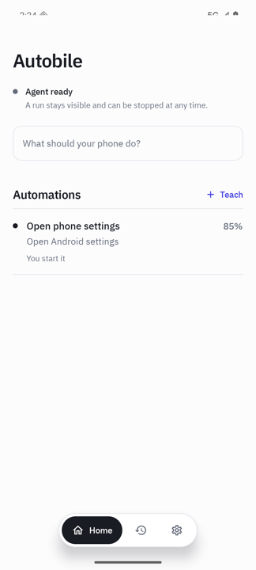
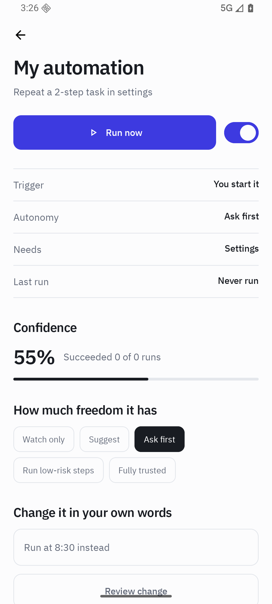
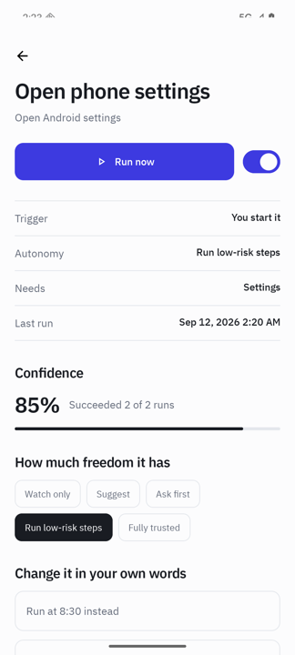

# Autobile

**English** · [한국어](README.ko.md)

Autobile operates your Android phone for you. Tell it what you want in plain words, or
show it once, and it does the task — on a schedule, when a notification arrives, or
whenever you ask.

It is not a macro recorder. A recorder replays taps at fixed coordinates and breaks the
moment an app moves a button. Autobile records what each control *meant* — "the daily
sales menu", "yesterday", "the send button" — and finds those things again on a screen
that has changed.

<p align="center">
  
  
  
</p>

## What you can do with it

A few things people actually repeat every day:

- **A daily report.** Open your work app, read yesterday's figure, post it to a chat
  channel at 9:00 every weekday.
- **Arrival routine.** When a delivery notification arrives, open the courier app, check
  the status and save it somewhere.
- **Filing.** Open a document that arrived in a chat, save it to the right folder, mark
  the message read.
- **Anything fiddly you do the same way every time.** Five taps buried three menus deep,
  done for you.

You teach it once, or just ask. After that it runs without you, and shows you what it did.

## Getting started

### 1. Install

Download the APK from the
[latest release](https://github.com/autobile/autobile/releases/latest) and install it.
Autobile is not on Google Play — see [Distribution](#distribution).

You will need Android 11 or newer.

### 2. Grant screen control

Autobile walks you through this on first launch. It needs Android's **accessibility
access**, which is what lets it read what is on screen and tap for you.

This is a large permission and the app says so plainly. Without it Autobile cannot do
anything at all; with it, it can see any screen you open.

Setup also asks to post notifications. Worth allowing: an automation works by opening
someone else's app, and the notification is how you see what is running, stop it, and get
back to Autobile afterwards. Two further permissions are genuinely optional —
notification *access* enables notification triggers, and display-over-apps draws progress
on top of the app being operated.

### 3. Watch one run

Setup includes a safe first automation that opens your phone's settings and then checks
that the settings app actually appeared. It exists so you can see the agent operate the
phone before you teach it anything of your own.

### 4. Teach your own

Tap **Teach**, give it a name, and start recording. Then:

1. Leave Autobile and go to the app you actually use
2. Do the task once, normally
3. Come back through the notification and tap **Finish and understand**

Autobile then tells you what it thinks you were doing:

> This is what I understood
> **Check yesterday's net sales and post it to #daily-sales**

Read it carefully. This is the moment to catch a misunderstanding, and it is much cheaper
than catching it a week later. If something is wrong, type the correction in your own
words — "send net sales, not gross" — and the steps get rewritten, not just the label.

Not every correction is a step. "Always pick the hard difficulty" or "close the daily
reward if it shows up" are things you know and the demonstration never showed. When a
correction cannot be expressed as recorded steps, Autobile keeps it as an instruction and
follows it on every run, with the demonstration as the route it was shown rather than a
script it must replay. You can add more the same way from the automation's page later.

### Or just ask

Type what you want on the home screen — "finish today's sudoku", "turn on dark mode in
Settings". A request that matches something you taught runs that automation. Anything
else runs as a one-off task: Autobile opens the app you named and works toward the goal
from what is on screen, asking you before it starts. Nothing is saved unless you teach it.

On an automation's page you can also give an instruction for one run only — "on hard this
time" — without changing what it normally does.

### 5. Decide when it runs

On the automation's page you set:

- **Trigger** — you start it, a time each day, or a notification arrives
- **How much freedom it has** — from watch-only to fully trusted

Anything that sends a message, spends money or deletes something asks you first, whatever
freedom you granted, until you explicitly trust that automation.

## How the AI part works

Two things decide what happens on screen: the route you showed, and an agent that works
toward the goal from what it sees.

**The route comes first.** A taught step is found again by the id or label recorded when
you taught it, which needs no inference and no network. Most runs of a stable automation
end here.

**The agent takes over when the route stops fitting.** A reward pop-up that did not exist
when you taught it, a tutorial after an update, a puzzle whose next move depends on the
board, a button that moved three screens deeper. Each turn the agent looks at the screen,
chooses the next few actions — tap, long-press, swipe, type, scroll, back, wait, or open
an app — and is told on the next turn what they did. The first failure is treated as an
interruption: the agent gets past it and hands back to the route. A second one means the
route no longer fits, and the agent finishes the goal itself. Automations with
instructions the route cannot express, and requests you only typed, are driven by the
agent from the start.

The agent is never given the run. Every action it proposes is checked before it happens:

- It cannot touch the status bar, the navigation bar or Home, or act on Autobile itself
- It stays in the apps the task is about, and returns there when something else opens
- Anything that buys, pays, transfers or subscribes — whether the agent says so or the
  control's words do — waits for your approval, as does anything it declares as sending,
  posting or deleting
- A rejected or failed action is reported back to it instead of ending the run; running
  out of budget, making no visible progress, a protected screen, or your stop button do
- It may only report success after two consecutive fresh looks at the screen agree

Reasoning runs on the cheapest runtime that can answer:

| | What it does | Needs |
|---|---|---|
| **1. Rules** | Finds the control by the id or label recorded when you taught it | Nothing |
| **2. On-device AI** | Works out which control means the same thing when the app changed | A phone with on-device AI |
| **3. Local model** | Same job, using a model you downloaded | Optional, off by default |
| **4. Cloud** | The agent's turns, a redesigned screen, a new path to the same goal | Your own API key or subscription |

### When the screen cannot be read

Steps 1 to 3 all work by finding a *named* control — an id, a label, a description. That
is not always possible. A game draws its own interface onto a canvas, and so do video
players and anything built in Unity or Unreal: to Android's accessibility layer the whole
screen is one blank rectangle. Other apps are worse in a subtler way — full of elements,
none of which name anything a person would recognise.

Whenever the accessibility tree cannot answer, for either reason, Autobile looks at a
screenshot and works out *where* to touch, then touches that place. It is the last thing tried, never the first, because aiming at a position is
exactly the brittleness this app exists to avoid — but refusing to operate those apps at
all is the worse answer. Sending a screenshot is the separate switch described below, so
this path only exists if you turned it on.

Open **Settings → This device** to see which of these your phone can actually do. Autobile
detects it at startup and tells you, rather than pretending.

### Using it without any AI

It works. Automations you have already taught keep running on rules alone. What you lose
is the ability to adapt when an app changes its layout — a step that can no longer be
found pauses and says so, instead of the automation quietly breaking.

### Connecting a cloud provider

Optional, off by default, and nothing leaves your phone until you turn it on.

1. Open **Settings → Cloud assistance → Use the cloud**
2. Select a provider
3. Paste that provider's API key, or use browser sign-in for the experimental ChatGPT
   subscription provider

The endpoint defaults to Google's Gemini API and is editable, so you can point it at a
compatible deployment you control instead. Subscription sign-in follows the Codex PKCE
browser flow and refreshes the grant before it expires. OpenAI documents ChatGPT sign-in
for Codex clients, but does not promise this third-party integration as a stable public
API; keep the API-key provider available if the subscription surface changes.

Two separate switches, on purpose:

- **Use the cloud** sends a short text description of the screen — element labels, not
  pixels — when nothing on the phone can answer
- **Send screenshots** is a second, independent choice. Many people are fine sending a few
  lines of interface text and not fine sending a picture of their screen.

Before anything is sent, Autobile cuts the screen down to the handful of elements that
matter and masks anything that looks like a code, card number or address.

## What it will not do

Deliberate limits, not missing features:

- **Password managers and authenticators are blocked**, and cannot be unblocked by an
  automation
- **Financial and health apps ask first**, as does any app Autobile does not recognise
- **Nothing is bought, paid or subscribed without you.** The agent's actions go through the
  same risk gate as taught steps, and it cannot approve its own request
- **A protected screen stops the run.** If Android refuses a screenshot because the window
  holds sensitive content, Autobile reports that and stops rather than working around it
- **A partial run is reported as partial.** If some steps worked and the goal was not
  reached, it says so. Telling you an automation finished when it did not is the worst
  thing this app could do
- **A repair that changes meaning waits for you.** Autobile will re-point a step at a
  moved button on its own; it will not turn "read this number" into "send this number"
  without asking

There is a **Stop all automation** switch at the top of settings. Nothing runs while it
is on.

## Languages

English and Korean, following the per-app language you pick in Android settings.

Adding a language is one file:

1. Copy `app/src/main/res/values/strings.xml` to `app/src/main/res/values-<code>/strings.xml`
2. Translate the values, leaving the `name` attributes alone
3. Build

Nothing else needs editing. The list Android offers is generated from whichever
`values-<code>` folders exist, so it cannot drift out of step with the translations.

Stored execution history deliberately keeps the wording it had when the run happened,
because a record that changes language later is no longer a record of what happened.

## Project status

Early. The core loop — teach, confirm, compile, replay, validate, repair — works and is
covered by automated unit tests plus instrumentation tests that run on a device against the
shrunk release build. What has not been measured at scale is how reliably learned
automations hold up across the long tail of third-party apps.

Try it and report what breaks. Do not rely on it unattended for anything that matters yet.

## Distribution

Autobile is not on Google Play. Android's accessibility policy restricts what an app may
do with that permission, and store rules change over time. Direct release is the
appropriate channel for the full runtime; the APK above is signed with a stable key, so
Android will refuse an update that did not come from this project.

---

## For developers

### Build

Android SDK 36 and **JDK 21** — Robolectric's Android 36 sandbox does not run on 17. Set
`sdk.dir` in `local.properties` or export `ANDROID_HOME`, then:

```bash
./gradlew assembleDebug
```

### Test

```bash
./gradlew lintDebug test assembleDebug
```

CI runs the same command on every pull request.

Instrumentation tests need a connected device or emulator:

```bash
./gradlew connectedAndroidTest
```

Before changing anything serialised or reached reflectively, run them against a build
carrying the real release shrinking rules:

```bash
./gradlew connectedAndroidTest -PautobileTestBuildType=releaseTest
```

Stored automations decode through generated serializers that R8 can remove while the build
still succeeds and every unit test still passes. That failure would surface on a user's
phone after an update, as every automation they taught disappearing.

### Layout

```text
app/       Compose UI, onboarding, dependency wiring, and user-facing settings
core/      Domain models, privacy-safe storage, policy, history, and metrics
ai/        Provider-neutral inference interfaces, runtime router, and bounded tasks
runtime/   Accessibility, perception, execution, validation, recovery, and triggers
```

Modules point inward: `app` assembles the process, `runtime` owns the agent loop, `ai`
owns inference boundaries, and `core` depends on neither.

### Contributing

See [CONTRIBUTING.md](CONTRIBUTING.md). Bug reports and ideas are welcome through
[issues](https://github.com/autobile/autobile/issues); anything that could be used against
a running install should go through a
[private advisory](https://github.com/autobile/autobile/security/advisories/new) instead —
see [SECURITY.md](SECURITY.md).

### License

[MIT](LICENSE).
